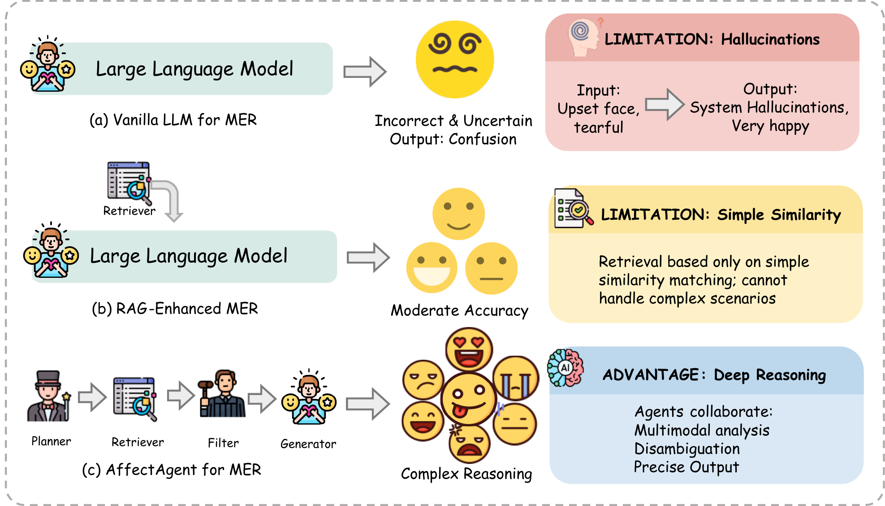
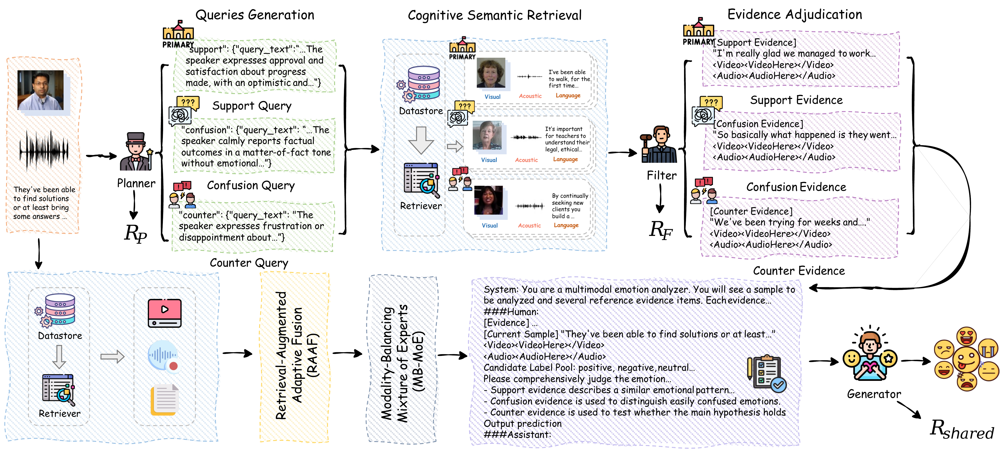

<h1 align="center">🧠 AffectAgent</h1>

<h3 align="center">Collaborative Multi-Agent Reasoning for Retrieval-Augmented Multimodal Emotion Recognition</h3>

<p align="center"><strong>Official implementation of the ACM Multimedia 2026 paper</strong></p>

<p align="center">
  <a href="https://arxiv.org/abs/2604.12735"></a>
  <a href="https://doi.org/10.1145/3767308.3835848"></a>
  
  
  
  <a href="LICENSE"></a>
</p>

<p align="center">
  <a href="#overview">Overview</a> •
  <a href="#method-overview">Method</a> •
  <a href="#installation">Installation</a> •
  <a href="#quick-start">Quick Start</a> •
  <a href="#hardware-and-runtime">Hardware</a> •
  <a href="#reproducibility">Reproducibility</a> •
  <a href="#citation">Citation</a>
</p>

<p align="center">⭐ If AffectAgent helps your research, please consider starring the repository and citing the paper.</p>

<p align="center">
  <a href="assets/affectagent-teaser.png">
    
  </a>
</p>

<p align="center"><em>
AffectAgent replaces one-shot emotion prediction with collaborative planning, retrieval, evidence filtering, and generation.
</em></p>

---

<a id="overview"></a>
## 🧠 Overview

AffectAgent is a retrieval-augmented multi-agent framework for multimodal emotion recognition (MER). One shared multimodal Actor performs three specialized roles, while a frozen dual-channel Retriever supplies cognitive and perceptual evidence:

```text
Multimodal input
      ↓
Query Planner → Dual-channel Retriever → Evidence Filter → Emotion Generator
                         ↓                       ↓
                 cognitive + perceptual   support / confusion / counter
```

### Highlights

- **Collaborative reasoning:** a Query Planner, Evidence Filter, and Emotion Generator cooperate through structured intermediate outputs.
- **Dual-channel retrieval:** cognitive semantic evidence and perceptual audiovisual evidence complement the current sample.
- **Adaptive multimodal fusion:** RAAF injects retrieved support; MB-MoE balances visual, acoustic, and language information.
- **Paper-aligned optimization:** shared/local rewards, two counterfactual predictions, terminal KL regularization, token-level GAE, and clipped MAPPO updates.
- **Transparent release scope:** implemented components and unavailable experiments are reported explicitly in the reproduction matrix.

<a id="method-overview"></a>
## 🧩 Method Overview

<p align="center">
  <a href="assets/affectagent-framework.png">
    
  </a>
</p>

<p align="center"><em>
The Query Planner constructs support, confusion, and counter queries; the Retriever gathers multimodal evidence; the Evidence Filter adjudicates candidates; and the Emotion Generator produces the final prediction.
</em></p>

<details>
<summary><strong>Paper-to-code map</strong></summary>

| Paper component | Implementation |
| --- | --- |
| Query Planner | `affectagent.prompts.build_query_planner_messages`, `AffectAgentPipeline.run_query_planner` |
| Evidence Filter | `affectagent.prompts.build_evidence_filter_messages`, `AffectAgentPipeline.run_evidence_filter` |
| Emotion Generator | `affectagent.prompts.build_emotion_generator_messages`, `AffectAgentPipeline.run_emotion_generator` |
| Cognitive semantic retrieval | `DualChannelRetriever.retrieve_channel_A` |
| Perceptual audiovisual retrieval | `DualChannelRetriever.retrieve_channel_B` |
| RAAF, equations (5)-(6) | `RetrievalAugmentedAdaptiveFusion` / `RAAF` |
| MB-MoE, equation (7) | `ModalityBalancingMoE` / `MBMoE` |
| Scores and rewards, equations (1)-(4) | `AffectiveRewardComputer.compute_pipeline_rewards` |
| MAPPO and GAE, equations (8)-(12) | `affectagent.mappo.PolicyGradientUpdater` |

</details>

<details>
<summary><strong>Method fidelity notes</strong></summary>

- All three agents use the same multimodal Actor. The Query Planner receives text, video, audio, and the candidate-label set.
- Training performs three predictions per sample: the full system, the simple-label replacement used by `Score_label`, and the Filter-bypass ranked evidence used by `Score_rank`.
- The shared reward is `Score_full`. Planner and Filter rewards add the incremental terms in equations (3) and (4); the Generator uses only the shared reward.
- The reference policy is a frozen copy of the role-specific SFT language policy, including its loaded adapters; frozen multimodal encoders provide the same encoded context.
- Task reward and sequence KL are assigned at the terminal token. Token-level advantages use GAE, followed by clipped Actor and Critic updates.
- Public APIs use `support`, `confusion`, and `counter`. Pre-release names remain available only through the compatibility layer.

</details>

<a id="release-status"></a>
## 🚦 Release Status

| Component | Status | Notes |
| --- | :---: | --- |
| AffectGPT full pipeline | ✅ Ready | Planner, Retriever, Filter, Generator |
| RAAF and MB-MoE | ✅ Ready | Jointly optimized fusion modules |
| MAPPO and token-level GAE | ✅ Ready | Paper-aligned rewards and counterfactuals |
| Training and evaluation CLIs | ✅ Ready | Full pipeline and supported ablations |
| Pretrained checkpoints | 📦 External | Not bundled with the source release |
| Additional paper backbones | ➖ Not included | AffectGPT is the supported backbone in this release |
| Missing-modality experiments | ➖ Not included | Intentionally deferred from the current release |

<a id="installation"></a>
## ⚙️ Installation

The reference software environment uses **Python 3.10**, **PyTorch 2.4.0**, **CUDA 12.1**, and **Transformers 4.49.0**.

```bash
conda create -n affectagent python=3.10 -y
conda activate affectagent

pip install torch==2.4.0 torchvision==0.19.0 torchaudio==2.4.0 \
  --index-url https://download.pytorch.org/whl/cu121
pip install -r requirements.txt
```

Configure dataset and pretrained-model roots in `config.py`, then pass the role-specific AffectGPT SFT checkpoint at runtime:

```bash
--options model.ckpt_3=/absolute/path/to/affectgpt_sft_checkpoint.pth
```

Large datasets, pretrained weights, generated retrieval indexes, checkpoints, and outputs are intentionally excluded from Git.

<a id="quick-start"></a>
## 🚀 Quick Start

```text
Role-specific SFT data → Retrieval artifacts → MAPPO training → Evaluation
```

### 1. Prepare role-specific SFT data

```bash
python -m affectagent.build_sft_data_planner --help
python -m affectagent.build_sft_data_filter --help
python -m affectagent.build_sft_data_generator --help
```

The builders use an OpenAI-compatible teacher endpoint. Provide credentials through environment variables only:

```bash
export OPENAI_API_KEY=...
export OPENAI_BASE_URL=...  # optional compatible endpoint
```

These commands prepare role-specific records. Optimize them with the upstream AffectGPT SFT workflow; the checkpoint passed to MAPPO must contain this warm start.

### 2. Build retrieval artifacts

Build the cognitive semantic index:

```bash
python -m affectagent.build_semantic_index \
  --output-dir affectagent/artifacts/semantic_index \
  --device cuda
```

Build perceptual audiovisual indexes and token sequences:

```bash
python -m retrieval.faiss.build_mercaptionplus_faiss \
  --cfg-path configs/affectagent.yaml \
  --options model.ckpt_3=/path/to/affectgpt_sft_checkpoint.pth \
  --output-root retrieval/faiss/artifacts/mercaptionplus \
  --device cuda:0
```

For a short artifact smoke test, add `--max-samples 32`. Use `--overwrite` only when intentionally replacing an existing output directory.

### 3. Train with MAPPO

```bash
python -m affectagent.train_ppo \
  --cfg-path configs/affectagent.yaml \
  --options model.ckpt_3=/path/to/affectgpt_sft_checkpoint.pth \
  --dataset mercaptionplus \
  --semantic-index-dir affectagent/artifacts/semantic_index \
  --multimodal-index-dir retrieval/faiss/artifacts/mercaptionplus \
  --output-dir output/affectagent_mappo \
  --gamma 0.99 \
  --gae-lambda 0.95 \
  --lambda-planner 1.0 \
  --lambda-filter 1.0 \
  --gpu 0
```

Each sample runs the full prediction plus the two paper-defined counterfactual predictions. For an environment smoke test, append:

```bash
--max-samples 2 --num-epochs 1 --batch-size 1 --ppo-epochs 1
```

### 4. Evaluate

```bash
python -m affectagent.evaluate \
  --cfg-path configs/affectagent.yaml \
  --options model.ckpt_3=/path/to/affectgpt_sft_checkpoint.pth \
  --ckpt-dir output/affectagent_mappo/best_model \
  --dataset mer2023 \
  --semantic-index-dir affectagent/artifacts/semantic_index \
  --multimodal-index-dir retrieval/faiss/artifacts/mercaptionplus \
  --variant full \
  --output-dir output/evaluation/mer2023_full \
  --gpu 0
```

The evaluator reports WAR, UAR, macro-F1, per-class recall, and per-sample diagnostics.

### Supported ablations

| Variant | Behavior |
| --- | --- |
| `full` | Complete AffectAgent |
| `no_planner` | Replace rich Planner queries with the simple-label counterfactual |
| `no_filter` | Bypass the Filter and pass ranked Top-K evidence to the Generator |
| `no_raaf` | Keep MB-MoE while removing retrieval-augmented adaptive fusion |
| `no_mb_moe` | Keep RAAF while removing modality-balancing experts |

<a id="hardware-and-runtime"></a>
## 🖥️ Hardware and Runtime

| Item | Configuration or status |
| --- | --- |
| Reference software | Python 3.10, PyTorch 2.4.0, CUDA 12.1, Transformers 4.49.0 |
| Device selection | One visible CUDA device selected with `--gpu`; index builders also accept `--device` |
| Full training requirement | CUDA GPU, licensed datasets, pretrained encoders, an AffectGPT SFT checkpoint, and both retrieval indexes |
| Compute characteristic | MAPPO performs three generation passes per sample, so it is heavier than ordinary single-pass fine-tuning |
| Training time | Not reported in the paper and not yet benchmarked for this packaged release |

Actual memory use and wall-clock time depend on the backbone checkpoint, generation length, retrieval size, batch size, precision, and GPU model. The smoke-test command verifies wiring only; it is not a reproduction of the paper's reported benchmark results.

<a id="checkpoints"></a>
## 💾 Checkpoints

| File | Contents |
| --- | --- |
| `affectgpt_trainable.pth` | Trainable AffectGPT policy parameters |
| `raaf.pth` | Retrieval-Augmented Adaptive Fusion |
| `mb_moe.pth` | Modality-Balancing Mixture of Experts |
| `critic.pth` | Token-level value head |
| `checkpoint_manifest.json` | Checkpoint schema and compatibility metadata |

Evaluation also accepts the pre-release names `support_fusion.pth`, `modality_moe.pth`, and `value_head.pth`. Existing imports under `retrieval.mmoa_lite` remain compatibility wrappers; new projects should import from `affectagent`.

<a id="reproducibility"></a>
## 🧪 Reproducibility

### Paper experiment matrix

| Paper claim or experiment | Command or config | Release status |
| --- | --- | --- |
| AffectGPT full AffectAgent pipeline | `affectagent.evaluate --variant full` | Implemented |
| Multimodal Planner / Filter / Generator | canonical prompts and `AffectAgentPipeline` | Implemented |
| RAAF and MB-MoE | `RAAF`, `MBMoE` | Implemented |
| Shared/local rewards | `lambda-planner`, `lambda-filter` | Equations (1)-(4) implemented |
| MAPPO with terminal KL, GAE, clipped value loss | `affectagent.mappo` | Equations (8)-(12) implemented |
| Planner and Filter counterfactual ablations | `no_planner`, `no_filter` | Implemented |
| RAAF and MB-MoE ablations | `no_raaf`, `no_mb_moe` | Implemented |
| AffectGPT benchmark loaders | MER2023, MER2024, MELD, IEMOCAP | Implemented |
| Emotion-LLaMA, Video-LLaMA, Video-LLaMA2, VideoChat, ChatBridge, PandaGPT | backbone-specific upstream integrations | Not included |
| Missing-modality experiments | modality masking configurations | Not included |

The final two rows are explicit release boundaries; they are not simulated by metadata-only switches.

### Validation

```bash
python -m unittest discover -s tests -v
python -m compileall -q config.py affectagent my_affectgpt retrieval toolkit tests
```

The release test suite covers structured-output parsing, multimodal Planner inputs, paper reward equations, both counterfactual paths, checkpoint compatibility, RAAF/MB-MoE tensor shapes, and token-level GAE.

<details>
<summary><strong>Repository layout</strong></summary>

```text
affectagent/                     agents, retrieval, fusion, rewards, MAPPO, CLIs
assets/                          README figures rendered from the paper
configs/affectagent.yaml         portable AffectGPT configuration
my_affectgpt/                    AffectGPT multimodal backbone
retrieval/faiss/                 audiovisual index construction
retrieval/mmoa_lite/             deprecated import and CLI compatibility wrappers
tests/                           alignment, parser, GAE, fusion, compatibility tests
toolkit/                         dataset utilities used by AffectGPT
```

</details>

<a id="citation"></a>
## 📝 Citation

If this project is useful in your research, please cite:

```bibtex
@inproceedings{wang2026affectagent,
  title     = {AffectAgent: Collaborative Multi-Agent Reasoning for Retrieval-Augmented Multimodal Emotion Recognition},
  author    = {Wang, Zeheng and Yu, Zitong and Zhu, Yijie and Zhao, Bo and Liang, Haochen and Wang, Taorui and Xia, Wei and Zhang, Jiayu and Liu, Zhishu and Ma, Hui and Ma, Fei and Tian, Qi},
  booktitle = {Proceedings of the 34th ACM International Conference on Multimedia},
  year      = {2026},
  doi       = {10.1145/3767308.3835848}
}
```

## 📄 License

Released under the [Apache License 2.0](LICENSE).

---

<p align="center">
  <strong>AffectAgent</strong> — plan, retrieve, adjudicate, and reason over multimodal affective evidence.
</p>
